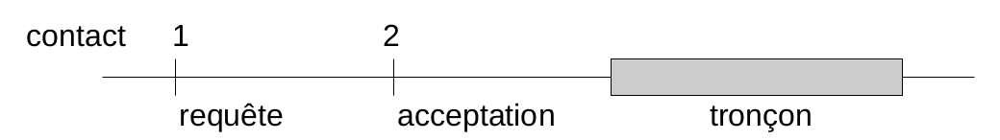
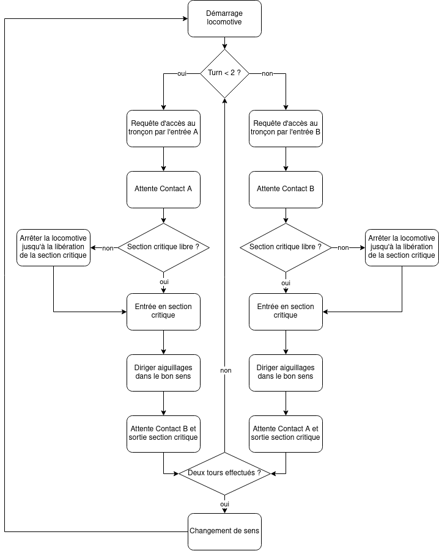
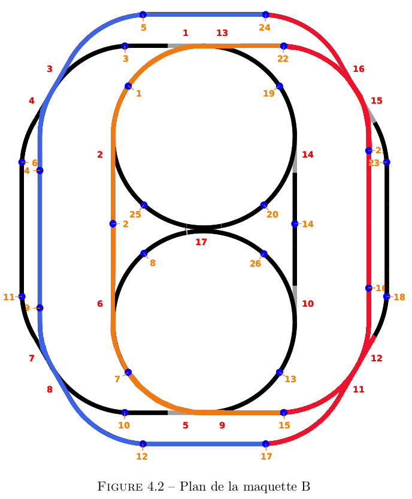

---
title: "Laboratoire 4: Gestion de ressources"
author: [Nicolas Wichoud, Olivier D'Ancona]
date: "12-12-2021"
subject: "train"
keywords: [train, qsim, labo4, simulation]
lang: "fr"
titlepage: true
...

# Laboratoire 4 Gestion de ressources

## Description des fonctionnalités du logiciel

Le but de ce laboratoire est de programmer des locomotives parcourant sur le même circuit deux tracés circulaires partageant un même tronçon. En premier temps, le code sera exécuté dans une simulation et si tout se passe bien, il pourra ensuite tourner sur une vraie maquette Märklin. 

### Programme 1 

Les locomotives partent d’un point particulier de leur tracé. Chaque fois que les locomotives réalisent 2 tours complets, elles inversent leur direction et repartent pour 2 tours supplémentaires dans le sens contraire, et ceci de manière infinie.

### Programme 2

C'est le même fonctionnement que le programme 1 avec une gestion de priorité supplémentaire. Lors d’un accès au tronçon, la locomotive doit d’abord signifier sa demande (après le passage sur un contact), et plus tard vérifier si l’accès lui est autorisé directement ou non (après le passage d’un second contact). La demande du tronçon commun se réalise donc en 2 étapes délimitées par des contacts qui précèdent le tronçon :

- contact 1 : arrêt de la locomotive ou passage de celle-ci en cas d’acceptation.
- contact 2 : formulation de la requête avec l’identifiant de la locomotive en paramètre.

Les priorités sont définies de manière dynamique selon le schéma suivant:

- Si les deux locomotives accèdent au tronçon par le même point d’entrée, alors la locomotive LA a la priorité.
- Si les deux locomotives accèdent au tronçon par un point d’entrée distinct (EA pour l’une et EB pour l’autre), alors la locomotive LB a la priorité sur LA.

### Structure du code

#### LocomotiveBehavior

Cette classe implémente le comportement de la locomotive selon le tracé. Elle stocke les points de contacts et d'entrée en section critique ainsi que le nombre de tours respectif à chaque locomotive. Chaque Locomotive aura un comportement programmé qui inter-réagira avec la section partagée afin d'éviter tout accident. 

#### SharedSection

Cette classe définit le tronçon commun aux deux locomotives, elle possède 3 méthodes:
- getAccess(): permet de rentrer dans la section critique. 
- leave(): permet de quitter proprement la section partagée.
- request(): permet de gérer la priorité selon les demandes d'accès à la section partagée

#### Locomotive

Cette classe contient toutes les méthodes inhérentes à la locomotive : 

- Constructeur
- Méthode pour fixer le numéro
- Méthode pour fixer la vitesse
- Méthode pour déterminer la position initiale
- Affichage de message
- Allumer les phares
- Eteindre les phares
- Démarrage
- Arrêt
- Inversion du sens

#### Main

## Choix d'implémentation

### Choix du tracé

Afin de simplifier l'écriture du code, nous avons décidé de prendre 2 tracés avec une section partagée minimale.

Avec ce tracé, les points de requêtes seront 2,4 pour le haut et 2,9 pour le bas. De plus, les points de contacts seront 1,5 pour le haut et 7,12 pour le bas.

### Variable turn

Afin de comptabiliser le nombre de tour et en même temps de tenir compte du sens nous avons utilisé une variable turn. Les deux premiers tours, l'entrée de la section critique sera l'entrée A et le troisième et quatrième tour, l'entrée sera la B. De cette manière, nous pouvons contrôler le nombre de tour avec `turn % 2` et la direction avec `sens < 2`.

### Comportement de la locomotive

Comment avez-vous abordé le problème, quels choix avez-vous fait, quelle 
décomposition avez-vous choisie, quelles variables ont dû être protégées, ...

## Tests effectués

Description de chaque test, et information sur le fait qu'il ait passé ou non
